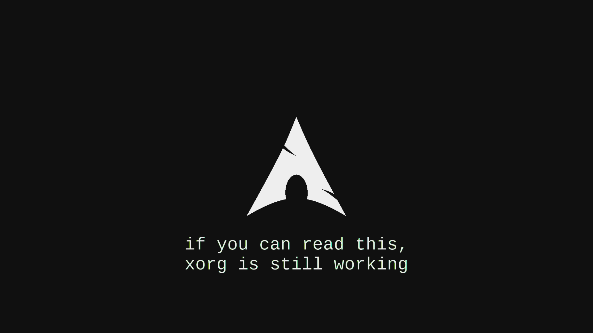

<div align="center">


<br>


<br><br>


<br><br>

# `I USE ARCH BTW`

### `sudo pacman -S curiosity`

</div>

---

## `01 // WHOAMI`

```bash
$ whoami
lucas

$ cat /etc/user.conf
name="Lucas Matheus"
role="Software Developer"
environment="Linux"
focus="Code + Systems + Security"
status="learning"
```

I'm a software development student who enjoys **Linux, programming, cybersecurity, backend development and understanding how systems work**.

I like building things, experimenting with new technologies and getting my hands dirty with the system underneath.

Sometimes that means writing code.

Sometimes that means spending two hours figuring out why something stopped working.

And sometimes...

```bash
$ sudo pacman -Syu

:: Synchronizing package databases...
:: Starting full system upgrade...

[ OK ] system updated
[ OK ] curiosity increased

$ echo $USER
lucas
```

---

## `02 // INTERESTS`

<div align="center">


</div>

<br>

```yaml
interests:
  linux:
    - Arch Linux
    - Unix environments
    - Wayland
    - system customization

  development:
    - Backend
    - APIs
    - Web development
    - Databases
    - Automation

  security:
    - Web security
    - Network security
    - Pentesting
    - Security labs
    - System hardening

  curiosity:
    - "How does it work?"
    - "Can I build it?"
    - "What happens if I change this?"
```

---

## `03 // TECH STACK`

### `languages`

<div align="center">


</div>

### `backend / web`

<div align="center">


</div>

### `tools / environment`

<div align="center">


</div>

### `security`

<div align="center">


</div>

---


---

## `04 // ARCH LINUX`

<div align="center">

### `I USE ARCH BTW`

<br>



<br>

> **Arch is not just the distro I use. It's the environment where I like to experiment.**

</div>

My setup revolves around:

```json
{
  "os": "Arch Linux",
  "display_server": "Wayland",
  "wm": "Hyprland",
  "shell": "zsh",
  "terminal": "foot",
  "editor": ["Neovim", "VS Code"],
  "browser": "Zen",
  "containers": "Docker"
}

## `05 // LINUX IS A HOBBY`

<div align="center">


</div>

Linux is one of the things I genuinely enjoy exploring.

I like customizing my environment, understanding what's happening under the hood, experimenting with different tools and solving problems that probably could have been avoided by using something simpler.

```bash
$ journalctl -b -p warning

warning: something broke

$ systemctl --failed

0 loaded units listed.

$ echo "nice."
nice.
```

---

## `06 // CYBERSECURITY`

Cybersecurity is another area I'm exploring because I enjoy understanding **how applications, networks and systems behave when things don't go exactly as expected**.

```python
security = {
    "web": [
        "HTTP / HTTPS",
        "APIs",
        "authentication",
        "OWASP concepts"
    ],

    "network": [
        "TCP/IP",
        "DNS",
        "packet analysis",
        "enumeration"
    ],

    "systems": [
        "Linux permissions",
        "processes",
        "shell environments",
        "hardening"
    ],

    "labs": [
        "CTFs",
        "virtual environments",
        "security testing",
        "experimentation"
    ]
}
```

> `learn → test → break → understand → improve`

---

## `07 // DEVELOPMENT`

```javascript
const lucas = {
    likes: [
        "building software",
        "Linux",
        "backend",
        "security",
        "automation",
        "learning new things"
    ],

    workflow: [
        "learn",
        "build",
        "test",
        "debug",
        "repeat"
    ]
};
```

I'm particularly interested in **backend development and systems**, but I like exploring different areas rather than limiting myself to one technology.

---

## `08 // GITHUB`

<div align="center">


<br>


<br>


</div>

---

## `09 // CURRENTLY`

<div align="center">


</div>

<br>

```text
learning is an infinite loop

while (curious) {
    learn();
    build();
    break_something();
    debug();
    understand();
}
```

---

## `10 // CONNECT`

<div align="center">

<a href="https://github.com/LM-btw">

</a>

<a href="https://www.linkedin.com/in/lucas-matheus-torres-cardoso-6996b8273/">

</a>

</div>

---

<div align="center">

<br>


<br><br>

`Linux` · `Code` · `Security` · `Systems`

<br><br>


<br><br>


</div>
